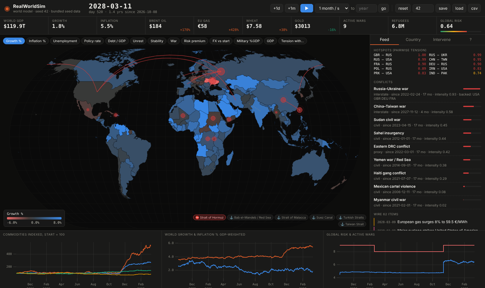

# RealWorldSim

**An open-source world model.** Every country on earth, simulated day by day — growth, inflation, interest rates, debt, currencies, oil and gas, food, civil unrest, tension, war — seeded from real public data and run forward into thousands of possible futures.

Think of it as a weather model, but for the world: initialise from today's observations, apply the dynamics, perturb, and watch what unfolds.



## What it is, and what it isn't

RealWorldSim is a **probabilistic scenario engine**, not an oracle. Run it once and you get *one* plausible future. Change the seed and you get another. The useful question is never "what will happen?" but "what happens in most runs, and what makes the difference?"

The world does not obey known equations the way the atmosphere does. Nobody has a formula for whether a government falls next month. So the model is deliberately a *reduced-form* one: simple, well-behaved relationships with sensible feedback loops, tuned to produce plausible macro numbers and dramatic-but-not-absurd geopolitics. Its accuracy is measured, not assumed: `rws backtest` starts the world in 2015, runs an ensemble to 2025 and scores it against what actually happened. The current score is poor (composite 0.53 of 1; see [docs/BACKTESTING.md](docs/BACKTESTING.md)) and the project is organised around moving it.

## Quick start

Requires Python 3.11+. Tested on Linux Mint; should work anywhere.

```bash
git clone https://github.com/thinusmilner1979-oss/RealWorldSim.git
cd RealWorldSim
python3 -m venv .venv && source .venv/bin/activate
pip install -e .
rws serve            # opens http://127.0.0.1:8050 in your browser
```

Headless, no UI:

```bash
rws run --years 20 --seed 7 -v
```

Pull today's real figures and start from them — either press **Sync now** on the dashboard's *Data* tab, or:

```bash
rws sync             # writes .rws_cache/live_seed.json; `rws serve` picks it up automatically
rws serve --auto-sync 7   # sync on launch whenever the cache is older than a week
```

Every source is free, needs no account or API key, and is fetched from your own machine.

Backtest it — start in 2015, run an ensemble to 2025, score it against what actually happened:

```bash
rws backtest --runs 50        # see docs/BACKTESTING.md for what the numbers mean
```

Linux Mint desktop launcher (creates a venv, installs, adds a menu entry):

```bash
./scripts/install-mint.sh
```

## Using it

* **Time**: play/pause, step a day or a month, or choose a speed from 1 day/s to 10 years/s. Type a year and press *go* to run to it.
* **Map**: colour every country by growth, inflation, unemployment, rates, debt, unrest, stability, war, risk, FX, military spending, GDP — or by *tension with* the selected country. Red pulses are active conflicts; dashed arcs are the highest-tension pairs.
* **Feed**: a wire of everything that happens — wars, ceasefires, coups, defaults, disasters, pandemics, market moves. Click an item to jump to the country.
* **Country**: click any country for its full state, history charts, top tensions, trade partners and sanctions.
* **Intervene**: set tension between any two countries, declare war, broker ceasefires, impose sanctions (bilateral or NATO+EU), close a shipping chokepoint (Hormuz, Red Sea, Malacca…), apply an oil supply shock, or hit a country with a recession, hyperinflation, revolution or default. Every intervention is logged.
* **Data tab**: sync live data per source with progress, see how old the cache is, restart the world from it.
* **Seeds**: same seed + same interventions = same world, always. Save and load worlds; export the global history as CSV.

## How the model works

Short version (the long version is in [docs/ARCHITECTURE.md](docs/ARCHITECTURE.md)):

| Layer | What it does |
|---|---|
| **Macro** (`engine/economy.py`) | Growth responds to real rates, oil prices, trading partners, unrest, war and sanctions. Inflation follows a Phillips curve with commodity and FX pass-through, anchored to a target. Central banks run a Taylor rule (badly, if the state is unstable). Okun's law for unemployment, debt accumulates from deficits, debt crises hit when sustainability breaks, exchange rates move with inflation and risk. |
| **Commodities** (`engine/commodities.py`) | Oil priced from country-level supply and demand, with war losses, sanctions, chokepoint closures and slow capacity growth. Gas (hub + European premium), wheat (breadbasket wars, drought, fertilizer), copper (industrial demand), gold (global risk). |
| **Geopolitics** (`engine/geopolitics.py`) | A 196×196 tension matrix driven by rivalries, geography, alliances, sanctions, arms build-ups, trade and spill-over. Wars break out stochastically at high tension, damped by nuclear deterrence, extended deterrence, the democratic peace and the **military balance** (an index from budget, personnel, technology and nuclear status); frozen conflicts escalate to full-scale war by decision, not drift; wars exhaust, end in ceasefire, or end **decisively** with the loser destabilised. Unrest rises with inflation surprises, unemployment, food prices, drought and economic collapse; high unrest topples governments, triggers coups or civil wars. Refugees flow to neighbours. |
| **Events & climate** (`engine/events.py`) | Per-country **drought index** driven by regional dry/wet spells, the El Niño cycle and a warming trend; feeds harvests, grain prices, growth in farm-heavy economies and unrest. Plus natural disasters, pandemics, financial crises, technology booms, cyber-attacks, terror. |
| **Data** (`sync/`, `data/`) | Bundled seed from Natural Earth plus curated 2025 estimates; live sync from World Bank, Our World in Data (energy, SIPRI, UN population, V-Dem), UCDP, GDELT, Open-Meteo + NOAA (climate), UNHCR, IMF PortWatch, Stooq and FRED. |
| **Backtest** (`backtest/`) | 2015 start state, parallel ensemble, scorecard of real outcomes, coverage / Brier / false-alarm scores. |

All tunable constants are in `engine/params.py`.

## Contributing

Yes please. This is a big, fun, open-ended problem and it needs economists, political scientists, data people, front-end people and anyone who likes tinkering with simulations. See [CONTRIBUTING.md](CONTRIBUTING.md) and the [ROADMAP.md](ROADMAP.md) for where help is most needed — the biggest items are **backtesting**, **government AI agents**, and **ensemble runs**.

## Data sources & licences

* Country geometry, population, GDP, regions: [Natural Earth](https://www.naturalearthdata.com/) (public domain)
* Live macro: [World Bank Indicators API](https://datahelpdesk.worldbank.org/knowledgebase/articles/889392) (CC BY 4.0)
* Energy, military spending (SIPRI), population (UN), democracy (V-Dem): [Our World in Data](https://ourworldindata.org/) grapher CSVs (CC BY 4.0)
* Conflict events: [UCDP GED](https://ucdp.uu.se/) (CC BY 4.0)
* News events: [GDELT 2.0](https://www.gdeltproject.org/) (free, attribution requested)
* Weather history: [Open-Meteo](https://open-meteo.com/) ERA5 archive (CC BY 4.0, non-commercial API use); El Niño index: [NOAA CPC](https://www.cpc.ncep.noaa.gov/)
* Refugees: [UNHCR Refugee Data Finder API](https://www.unhcr.org/refugee-statistics/) (CC BY 4.0)
* Shipping chokepoints: [IMF PortWatch](https://portwatch.imf.org/) (open)
* Prices: [Stooq](https://stooq.com/) and [FRED](https://fred.stlouisfed.org/)
* Front-end: [d3](https://d3js.org/) (ISC), [uPlot](https://github.com/leeoniya/uPlot) (MIT) — vendored, so the app runs offline.

Code is MIT licensed. The hand-curated figures in `data/overrides.json` are approximate 2025 estimates meant only to seed the model; `rws sync` replaces them with sourced values.
